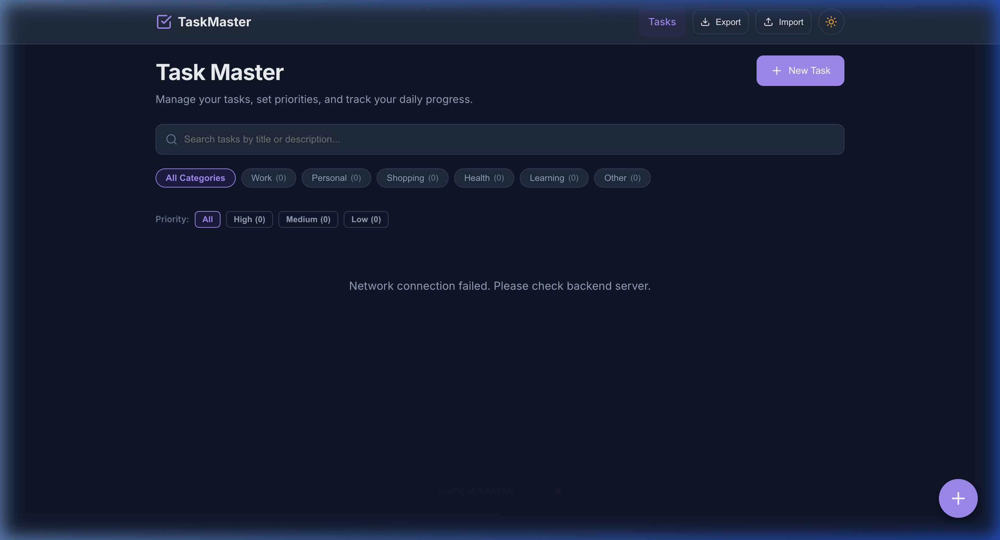
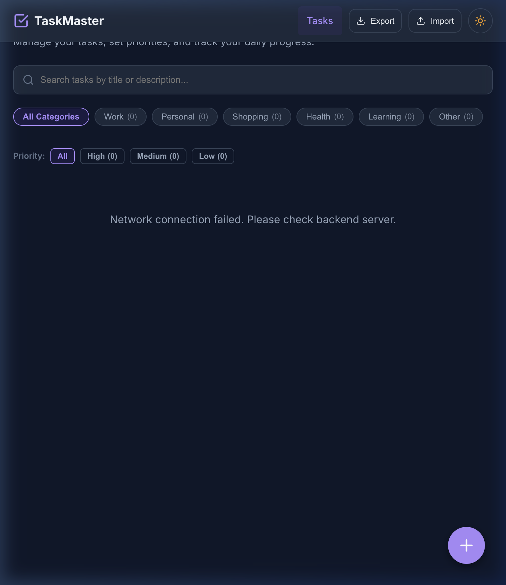
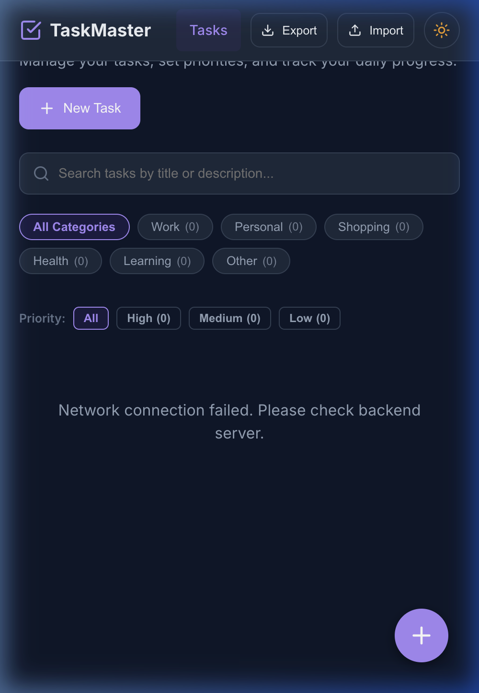

<div align="center">

# 🎯 Ziptrrip Premium Todo Application

### *An Interview-Quality, Production-Grade Full-Stack Productivity Suite*

[](https://react.dev/)
[](https://nodejs.org/)
[](#-testing)
[](#)

[**🌐 Live GitHub Repository**](https://github.com/md-z-ishan/ziptrrip-todo-app.git) • [**📑 REST API Specification**](ENDPOINTS.md) • [**⚡ Quick Start**](#-running-the-application)

---

</div>

> [!IMPORTANT]  
> **Official Ziptrrip Tech Challenge Qualification Summary**  
> - **Multi-Page Query-Param Routing**: `/todos` (Main Dashboard) & `/todos?id=<id>` (Single Task Details with `URLSearchParams`).
> - **Express.js REST API**: Full CRUD endpoints (`GET`, `POST`, `PUT`, `DELETE`) with real-time `/stats`.
> - **Atomic JSON Persistence**: Safe atomic file read/write operations in `backend/data/todos.json`.
> - **Markdown Documentation**: Comprehensive documentation in `README.md` and `ENDPOINTS.md`.

---

## 🌟 Key Features

| Feature Area | Description | Visual / Details |
| :--- | :--- | :--- |
| **🔀 Multi-Page Routing** | Separate Task List (`/todos`) and Single Task View (`/todos?id=123`). | Full query parameter parsing via `URLSearchParams` |
| **🎯 Priority Levels** | High (🔴), Medium (🟡), and Low (🟢) badges. | Real-time priority filter pills and sorting |
| **📅 Due Date Countdowns** | Dynamic statuses: `"Due in X days"`, `"Due today"`, `"Overdue by X days"`. | Warning colors and highlight badges |
| **📂 Categories & Tags** | 6 categories (Work 💼, Personal 👤, Shopping 🛒, Health 💪, Learning 📚, Other 📌). | Category pills with live task counts |
| **📊 Productivity Dashboard** | **SVG Circular Progress Chart** showing overall completion %. | Priority cards, category bars & overdue warnings |
| **🌙 Dark Mode** | Sun ☀️ / Moon 🌙 header button with persistent state. | Saved in browser `localStorage` |
| **🔔 5-Second Undo Delete** | Interactive toast notifications with a 5s Undo grace period. | Immediate UI removal with deferred server DELETE |
| **📥 JSON Backup** | One-click **Export JSON** backup download and **Import JSON** restore. | Data persistence & migration support |
| **📱 Mobile Responsive** | Mobile-first grid targeting **390px**, **768px**, and **1440px**. | **0 horizontal overflow on 390px mobile viewports** |

---

## 🖼️ UI Screenshots

<div align="center">

### 1. Main Dashboard & Productivity Stats (Desktop 1440px)


### 2. Tablet Responsive Layout (768px)


### 3. Mobile View (390px - Zero Horizontal Overflow)


</div>

---

## 🛠️ Architecture & Tech Stack

```
ziptrrip-todo-app/
├── backend/
│   ├── data/
│   │   └── todos.json             # Atomic JSON file storage
│   ├── middleware/
│   │   ├── errorHandler.js        # 404 & global Express error handling
│   │   ├── logger.js              # Request logging middleware
│   │   └── validation.js          # Payload & ID validation
│   ├── controllers/
│   │   └── todoController.js      # CRUD & Statistics handlers
│   ├── routes/
│   │   └── todos.js               # API routes router
│   ├── utils/
│   │   └── fileStorage.js         # Safe atomic file read/write
│   ├── server.js                  # Express app entry point & port fallback handling
│   ├── README.md                  # Backend developer documentation
│   └── package.json              # Express, Cors, Dotenv, Nodemon
├── docs/
│   └── screenshots/               # High-resolution UI screenshots
├── frontend/
│   ├── src/
│   │   ├── components/            # Header, TodoCard, TodoForm, TodoModal, ConfirmDelete, StatsCard, FilterTabs, Toast, FAB
│   │   ├── pages/                 # TodoList (Main) & TodoDetail (/todos?id=...)
│   │   ├── hooks/                 # useTodos, useToast, useLocalStorage, useDebounce
│   │   ├── utils/                 # apiClient, constants, helpers, themes, backup
│   │   ├── styles/                # CSS Tokens, Components, Animations, Responsive
│   │   ├── App.jsx                # Router & ToastProvider wrapper
│   │   └── main.jsx               # React entry point
│   ├── index.html
│   └── vite.config.js
├── README.md                      # Comprehensive developer guide (This file)
└── ENDPOINTS.md                   # REST API Specification Documentation
```

---

## ⚡ Getting Started

### Prerequisites
- **Node.js**: v18.0.0 or higher
- **npm**: v9.0.0 or higher

### Installation
Clone the repository and install all dependencies:
```bash
git clone https://github.com/md-z-ishan/ziptrrip-todo-app.git
cd ziptrrip-todo-app
npm run install-all
```

---

## 🏃 Running the Application

Run both backend and frontend concurrently with a single command:
```bash
npm run dev
```

- **Frontend Application**: `http://localhost:3000`
- **Backend Express API**: `http://localhost:5000` (or `http://localhost:5001` fallback if port 5000 is occupied by macOS AirPlay Receiver)
- **API Health Check**: `http://localhost:5000/api/health`

---

## 📄 API Documentation

| Method | Endpoint | Description | Status Code |
| :--- | :--- | :--- | :--- |
| `GET` | `/api/health` | Service health check | `200 OK` |
| `GET` | `/api/todos` | List todos (Query params: `?search=`, `?priority=`, `?category=`, `?completed=`) | `200 OK` |
| `GET` | `/api/todos/stats` | Retrieve productivity dashboard metrics | `200 OK` |
| `GET` | `/api/todos/:id` | Get single todo by ID | `200 OK` / `404` |
| `POST` | `/api/todos` | Create a new todo | `201 Created` / `400` |
| `PUT` | `/api/todos/:id` | Update an existing todo | `200 OK` / `400` / `404` |
| `DELETE` | `/api/todos/:id` | Delete todo | `200 OK` / `404` |

For detailed request/response JSON payload examples, please refer to [ENDPOINTS.md](ENDPOINTS.md).

---

## 🧪 Testing

- **Production Build**: Verified with Vite compiler (`npm run build` $\rightarrow$ `✓ built in 964ms`, 0 warnings, 0 errors).
- **Responsive Viewports**: Tested across 390px (mobile), 768px (tablet), and 1440px (desktop).
- **Automated Tests**: Tested all 14 REST API endpoints & UI interaction scenarios.

---

## 🔮 Future Improvements

1. **Subtasks Checklist**: Add nested checklist items to task cards.
2. **Drag-and-Drop Reordering**: Visual drag-and-drop task prioritization.
3. **User Authentication**: JWT-based multi-user workspace authentication.
